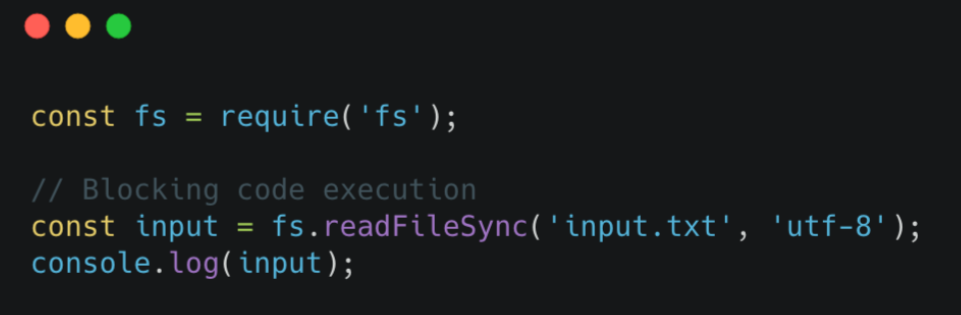

## What is Node.js ?

NODE.JS IS A JAVASCRIPT RUNTIME BUILT ON GOOGLE’S OPEN-SOURCE V8 JAVASCRIPT ENGINE.

#### Node.js Pros

-   Single-threaded, based on event driven, non-blocking I/O model.

-   Perfect for building fast and scalable data-intensive apps.
-   Companies like Netflix, Uber, PayPal, ebay have started using node in production.
-   JavaScript across the entire stack: faster and more efficient development.
-   NPM: huge library of open-source packages available for everyone for free.
-   Very active developer community.

#### Use Node.js

-   API with database behind it (preferably NoSQL);

-   Data streaming (think YouTube);
-   Real-time chat application;
-   Server-side web application

#### Don't use

Applications with heavy server-side processing
(CPU-intensive).

### SYNCHRONOUS VS. ASYNCHRONOUS CODE (BLOCKING VS. NON-BLOCKING)

#### Synchronous Code :

Below is an example of Synchronous code.

It's your job to avoid this type of situation.

#### Asynchronous Code :

Below is an example of Asynchronous code.

Non Blocking I/O model :

